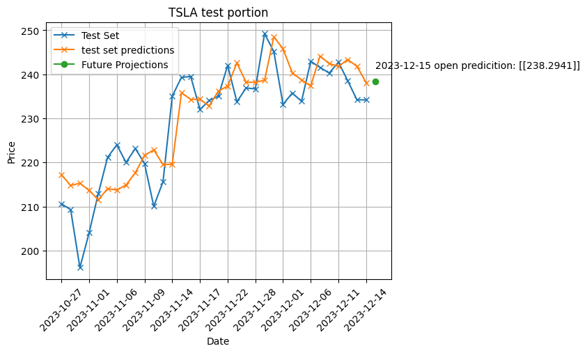

# FORCE PREDICTION RNN

This repository is a development environment for an ice-load predictor tool, based on my MRCNN repo (computer vision & data extraction). 

## 1. Tesla Stock Price Prediction Example
This repo contains a Jupyter notebook called devel.ipynb which contains an example simple implementation of a simple LSTM model to predict Tesla stock price the following day, based only on the open stock price of the previous n number of days.

### Total Data

### Validation Set

### Test Set

## 2. Force predictor for ice-ship loading
This is still WIP at the time of writing. 
